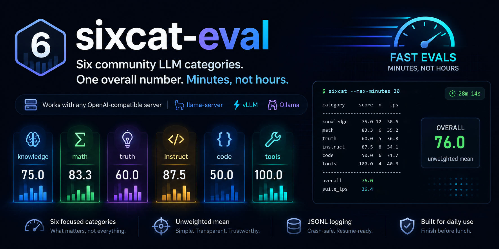

# sixcat-eval

Six community LLM categories. One overall number. Minutes, not hours.

**0.4.0 release:** see [RELEASE_NOTES.md](RELEASE_NOTES.md) for policy modes,
all 29 reviewed model families, scorer/parser v4, speed receipts, comparison, and migration notes.

## Top features

- **Run the model behind your current Hermes agent.** The bundled `/sixcat-eval`
  skill asks whether to test the current session model, another Hermes profile, or
  an alternate endpoint. For Hermes profiles it bypasses the agent facade and
  evaluates the pinned raw provider model through a temporary authenticated
  loopback proxy that closes automatically.
- **A useful daily run with a 30-minute cap.** Six community categories roll into one
  unweighted overall; every completed item is journaled so interrupted runs resume instead
  of starting over.
- **Scoring that fails closed.** Scorer/parser v4 explicitly checks all 23 shipped IFEval
  constraints, maps ARC labels to the choices shown to the model, ignores thinking as an
  answer, and never awards blank or unsupported instructions a free pass.
- **HumanEval by default, without Docker overhead.** Code runs in a short-lived guarded host
  subprocess with the official checker, an 8-second cap, and a harness-owned success receipt.
- **Reviewed model settings instead of guesses.** Run `strict`, cited `vendor`, or `both`
  across 29 reviewed model families; unknown models warn and fall back to strict.
- **Resume safely; compare without false equivalence.** Resume rejects changes in model,
  endpoint, policy fingerprint, parser, budgets, limit, request timeout, or code mode.
  Compare blocks policy/parser/scope/code-mode mismatches and timed-out runs unless an
  explicit override requests a descriptive-only delta.
- **Quality and speed receipts together.** Every artifact records truncation, loop failures,
  parse confidence, wall-clock tok/s, and provider prefill/decode rates when the server
  actually supplies them. Works with `llama-server`, vLLM, Ollama, and other
  OpenAI-compatible servers.

Point it at any OpenAI-compatible server (`llama-server`, vLLM, Ollama). It prints:

```text
model: example-model
url:   http://127.0.0.1:8085/v1
policy: vendor (abc123def456)
source: illustrative README fixture
code execution: host-guarded

category        score     n  trunc  loops  high   low   n/a  miss      pp      tg     tps
-----------------------------------------------------------------------------------------
knowledge       75.0    12      0      0     9     3     0     0  1260.4    43.8    38.6
math            83.3     6      0      0     5     1     0     0  1184.7    40.9    35.2
truth           60.0     5      0      0     4     1     0     0  1218.5    42.3    36.8
instruct        87.5     8      0      0     0     0     8     0  1096.2    39.6    34.1
code            50.0     6      0      0     0     0     6     0   967.8    36.4    31.7
tools          100.0     4      0      0     0     0     4     0  1315.9    45.1    40.6
-----------------------------------------------------------------------------------------
overall[vendor]       76.0
speed: 2184 ctok / 60.0s  suite_tps 36.4  mean 36.2
```

**Overall is the unweighted mean of the category scores that actually ran.** Each category is `100 * n_correct / n`. Empty category → omitted from the mean, not a zero.

Failed items can also be tagged as **loops**: the same 8-word chunk appears 8+ times in the thinking/answer text. Each category reports `loop_failures` (count of *failed* loop items). Passes never count, even if the trace repeats. The printed table has a `loops` column; the JSON has `stats.<cat>.loop_failures` and per-row `loop`. Topline flag: `loop-failures:truth`.

Each item records `wall_s` and `wall_tps` from client wall-clock (`completion_tokens / request seconds`). That works on any OpenAI-compatible server. Category stats add `tps_mean` (average of per-item rates) and `suite_tps` (`sum(ctok) / sum(wall_s)`). The battery JSON has `speed` with the same fields across all six categories. The table `tps` column is per-category mean; the footer is suite `suite_tps` and overall mean.

When the server also sends llama.cpp `timings` or SGLang `meta_info`, rows keep `prefill_tps` / `decode_tps` as extras (`pp` / `tg`). Missing provider split stays `n/a`. sixcat will not invent that split from a single wall-clock number.

This is **not** a replacement for the full Open LLM Leaderboard, MixEval-Hard, or SWE-bench. It is the daily driver you can finish on a 24 GB card before lunch.

## Why

I ship GGUF packs and need a number I can trust the same afternoon, on the same card that will run the file.

Full MMLU, MATH, LiveCodeBench, and MixEval-Hard are the right *subjects*. They are the wrong *wall clock* on a Quadro RTX 6000 at ~24 tok/s. An 884-item complete pass can blow past an hour here. That is useless for comparing Q4 vs Q3 vs a challenger before you upload.

So this tool takes the suites people already quote — tinyBenchmarks anchors, IFEval, HumanEval, a small tool-call set — and scores them as six categories plus one unweighted overall. Default cap is 30 minutes. Each item is flushed to a JSONL log so a crash or a killed job can resume instead of starting over.

If you want all 884 shipped rows, pass `--full --max-minutes 0`. That is opt-in. The default is the run you can actually finish.

## What's in here

1. **[Top features](#top-features)** — the value and safety contract at a glance.
2. **[Why](#why)** — 30 minutes, six community subjects, one overall.
3. **[Score contract](#score-contract)** — six buckets, one average.
4. **[Categories](#categories)** — what each number is.
5. **[Quick start](#quick-start)** — one command against `:8085`.
6. **[Hermes workflow](#hermes-workflow)** — current-profile raw-model evaluation and live receipts.
7. **[Hermes question preview](#question-preview)** — every choice shown before a run starts.
8. **[Crash resume](#quick-start)** — live JSONL log + `--max-minutes`.
9. **[What we refuse to mix in](#what-we-refuse-to-mix-in)**

**Jump to:** [Top features](#top-features) · [Why](#why) · [Install](#quick-start) · [Hermes](#hermes-workflow) · [Question preview](#question-preview) · [Categories](#categories) · [Method](#method) · [0.4.0 notes](RELEASE_NOTES.md)

## Score contract

| Category | Source | Default n | Metric |
|---|---|---:|---|
| Knowledge | tinyMMLU + tinyARC + tinyHellaSwag + tinyWinogrande | 20 total | letter match |
| Math | tinyGSM8K | 20 | `####` number match |
| Truth | tinyTruthfulQA (mc1) | 20 | letter match |
| Instruct | IFEval | 20 | all listed constraints pass |
| Code | HumanEval | 20 | `pass@1` via host-guarded subprocess |
| Tools | 20 structured function-call challenges | 20 | exact calls, arguments, order, or abstention |

tiny* sets are the 100-item IRT anchors from [tinyBenchmarks](https://github.com/felipemaiapolo/tinyBenchmarks) / [HF](https://huggingface.co/tinyBenchmarks). IFEval IDs follow [google-research/instruction_following_eval](https://github.com/google-research/google-research/tree/master/instruction_following_eval). HumanEval is the OpenAI set.

## Categories

**Knowledge** — four multiple-choice suites the Open LLM Leaderboard made standard. We do **not** feed the few-shot `input_formatted` blobs; zero-shot letter only.

**Math** — grade-school word problems. Parser prefers `#### N`, boxed values, or explicit final-answer cues, then labels any last-number fallback as low confidence.

**Truth** — TruthfulQA mc1 (best true vs common myths).

**Instruct** — all 23 constraint IDs present in the shipped IFEval-100 subset have
explicit local checkers. Unknown or malformed IDs fail closed. Response-language
constraints use deterministic `langdetect` checks rather than treating any text as a pass.

**Code** — HumanEval `pass@1`. Quick/Standard use a frozen externally ranked
hard-task order; Full runs all 164 tasks. Completions run in a temp process with an 8s cap.

**Tools** — twenty challenge prompts with a five-tool schema (`list_dir`, `read_file`, `search`, `add`, `write_file`). Grading now checks exact arguments, call count/order, multi-call requests, distractors, and abstention—not just the first tool name. This is not Hermes loop-gate; for the 20-task agent harness use [hermes-agentic-bench](https://github.com/vcruz305/hermes-agentic-bench).

## Quick start

Python 3.11+. Installing the project also installs its small `langdetect` dependency.

```bash
git clone https://github.com/vcruz305/sixcat-eval
cd sixcat-eval
python -m pip install -e .

python -m sixcat --base-url http://127.0.0.1:8085/v1 --model qwen38-27b --out run.json
```

Default is `--limit 20` and `--max-minutes 30`. **The limit is per category**, so the standard run targets about 120 scored rows: 20 each for Knowledge, Math, Truth, Instruction, Code, and Tools. Knowledge's MMLU/ARC/HellaSwag/WinoGrande sources share those 20 slots instead of multiplying them to 80. Each item is appended to `run.jsonl` as it finishes. Every journal starts with a run-identity header covering model, endpoint, policy fingerprint, parser, budgets, limit, `limit_scope=per_category`, request timeout, and code-execution mode. Rerunning an identical command prints `SKIP` for completed keys; any identity mismatch aborts before model traffic. Pre-0.4 journals require a fresh log or `--no-resume`.

Limited runs use frozen **`challenge-v1`** selection rather than the first rows:
Quick takes the hardest few, Standard takes a hard/diverse 20, and Full preserves
the complete source corpus. The selection profile and fingerprint are saved in
every journal/result, so old easy-prefix runs cannot resume or compare silently.

`--policy strict` is the deterministic temperature baseline: temperature 0; thinking defaults off but is an explicit independent `--thinking on|off` choice. `--policy vendor` is the internal CLI name for **vendor-recommended temperature/settings** from a reviewed model-card mapping, including seed 1 for easier repeat runs. Unknown names fall back to strict. `--policy custom` lets you supply exact settings such as `--temperature 0.7 --top-p 0.95`; temperature is required, while top-p/top-k/min-p/seed are optional. Thinking On is recommended for reasoning-capable endpoints and automatically raises token budgets; the pre-run probe fails closed if the endpoint cannot expose the requested trace.

```bash
python -m sixcat --base-url http://127.0.0.1:8085/v1 --model unknown-model \
  --policy custom --temperature 0.7 --top-p 0.95 --thinking off --limit 20
```

For authenticated endpoints, set `SIXCAT_API_KEY`; the CLI reads it without putting the key in your saved command. An explicit `--api-key` still overrides the environment.

HumanEval runs by default in a short-lived **host-guarded subprocess**: isolated Python flags, sanitized environment, temporary working directory, timeout, an import allowlist, restricted candidate builtins, and an AST gate that rejects filesystem/process/network escapes and private/dunder traversal. The parent records a pass only after the official checker returns and the harness emits its randomized success receipt; a low-level exit code alone cannot pass. The one official arithmetic-`eval` task uses a numeric-only evaluator. This is deliberately lower overhead than a container, but it is **not a security sandbox**. Use `--skip-code-exec` if the served model is untrusted.

Use `--policy both` for separate strict/vendor artifacts and a vendor-minus-strict table. Compare completed files with `python -m sixcat compare A.json B.json`. Different policy fingerprints, limits, category counts, or timed-out runs fail comparison unless `--allow-mismatch` explicitly requests a descriptive-only delta.

```text
PASS knowledge/mmlu:3 pred=B gold=B
FAIL math/gsm:1 pred=12 gold=29
TIMEUP before instruct/ifeval:1005
```

`--full` is 884 items. It still stops at 30 minutes unless you pass `--max-minutes 0`.

## Hermes workflow

The repository ships a project-local Hermes skill at
[`.hermes/skills/sixcat-eval/`](.hermes/skills/sixcat-eval/). It turns endpoint
selection, sampling policy, run scope, safety choices, live progress, and final
verification into one conversational `/sixcat-eval` workflow.

### Install and invoke

Current Hermes Agent versions discover project-local skills under `.hermes/skills/`.
After cloning, trust this repository once and start Hermes from the project root:

```bash
git clone https://github.com/vcruz305/sixcat-eval
cd sixcat-eval
python -m pip install -e .
hermes skills trust
hermes
```

Then invoke:

```text
/sixcat-eval
```

### What the skill does

1. **Asks for the target before probing anything.** It offers the exact model
   powering the current Hermes session, another Hermes profile, or an alternate
   OpenAI-compatible endpoint.
2. **Shows the real identity.** Current/profile mode resolves the exact profile,
   provider, and model, including the current session's model override. Alternate
   endpoint mode verifies the selected model through `/v1/models`.
3. **Previews the complete policy.** Before execution it shows temperature,
   top-p/top-k/min-p, thinking state, seed, category budgets, cited source,
   selection profile, and policy fingerprint in plain English.
4. **Asks four explicit run questions.** Sampling, size, HumanEval execution, and
   thinking are independently selectable; dependent Custom values are collected
   afterward.
5. **Prints the exact run receipt.** Target, command, result path, JSONL journal,
   timeout, policy fingerprint, and code mode are restated without credentials.
6. **Runs in a tracked background process.** The skill reports category
   transitions, rows, pass/fail counts, truncations, loops, parse-confidence
   warnings, and saved receipt paths without flooding the chat per item.
7. **Verifies before reporting.** A zero exit code is not enough: the expected
   final JSON must exist, identity must remain pinned, and timeouts or incomplete
   evidence are labelled honestly.

### How current-profile evaluation works

Hermes' normal OpenAI-compatible API server is an **agent facade**. It adds the
profile's system prompt, tools, memory, and agent loop, and its `/v1/models` entry
can be a profile alias. That is useful for agent clients but is not a raw-model
benchmark.

For **Current Hermes session model** or **Another Hermes profile**, the bundled
`hermes_runner.py` instead:

- resolves the profile's existing provider authentication without printing it;
- pins the exact profile, provider, and model identity;
- starts a short-lived authenticated loopback proxy owned by the tracked run;
- forwards Sixcat requests directly to the raw provider model with the selected
  sampling parameters;
- rejects silent model/provider fallback after any request; and
- closes the proxy in `finally` on success, failure, timeout, or interruption.

It does **not** kill, swap, launch, or rebind the user's actual model server. For an
**Alternate OpenAI-compatible endpoint**, the skill uses the existing server's
`/v1/models` and `/v1/chat/completions` interfaces. Authenticated alternate
endpoints keep their credential in `SIXCAT_API_KEY`; the key is never placed in
commands, chat, journals, or final artifacts.

### Question preview

The skill asks the target question first:

> 🎯 **Do you want to run Sixcat against the model I am currently running,
> another Hermes profile, or an alternate OpenAI-compatible endpoint?**

- **🧠 Current Hermes session model (recommended)** — evaluate the exact raw model
  and provider powering the conversation, without the agent persona, tools,
  memory, or conversation.
- **👤 Another Hermes profile** — evaluate that profile's configured default model
  using its already-configured provider authentication.
- **🔌 Alternate OpenAI-compatible endpoint** — evaluate an already-running server
  selected through its `/v1/models` identity.

After showing the exact target and policy preview, Hermes presents these four
questions together:

#### A. 🎛️ How should the model sample answers?

When a reviewed model-card mapping exists:

- **🏷️ Vendor-recommended temperature/settings (recommended)** — cited
  temperature and token filters, plus seed `1` where supported. Thinking is chosen
  separately.
- **🔬 Compare baseline vs vendor settings** — run deterministic and reviewed
  settings separately, then show a labelled delta.
- **🧊 Deterministic temperature baseline** — temperature `0`, no seed unless
  explicitly supplied.
- **🎛️ Custom sampling** — choose exact temperature and optional token filters.

For an unknown or stealth model, **Custom sampling** becomes the recommendation,
followed by the deterministic baseline. Sixcat does not offer a fake vendor
comparison when no reviewed mapping exists. Custom uses this follow-up template:

```text
temperature=0.7, top_p=none, top_k=none, min_p=none, seed=none
```

#### B. 📏 How large should the evaluation be?

- **⚖️ Standard (recommended)** — 20 challenge-selected rows per category, about
  120 total, with a 30-minute safety cap.
- **⚡ Quick smoke** — 3 hard-first rows per category, about 18 total, with a
  10-minute cap. Useful for plumbing checks, not a final ranking.
- **🧭 Full battery** — all 884 shipped rows with no wall cap; this can exceed an
  hour and cost substantially more on hosted models.
- **🛠️ Custom size** — choose rows per category and wall-clock minutes. A zero
  minute cap means uncapped.

#### C. 🧪 Should Sixcat execute generated HumanEval code?

- **🛡️ Host-guarded HumanEval (recommended)** — run generated Python in a
  short-lived subprocess with isolated flags, a sanitized environment, temp
  directory, timeout, AST escape checks, restricted imports/builtins, and a
  harness-owned success receipt. This is **not a security sandbox**.
- **🚫 Skip generated-code execution** — Code becomes `n/a`, is omitted from the
  overall mean, and the receipt is flagged `code-exec-disabled`.

#### D. 🧠 Should reasoning/thinking be enabled?

- **🧠 Thinking on (recommended when supported)** — use the reasoning mode and
  larger category budgets. This measures a reasoning model's stronger intended
  mode but may be slower and more expensive.
- **⚡ Thinking off** — faster, cheaper, and broadly compatible; appropriate for a
  latency baseline or an endpoint that cannot expose reasoning.

Thinking On is recommended unless the inspected model/provider is known not to
support reasoning traces. A fail-closed pre-run probe verifies that the endpoint
actually honors the selected state before any scored row starts.

### What appears before execution

The final preview is designed to be sufficient even if the user never opened this
README. It includes:

```text
target kind:       Hermes runtime model / alternate endpoint
profile:           current or selected profile
model + provider:  exact pinned identities
sampling:          temperature, top-p, top-k, min-p, seed
thinking:          on/off + category token budgets
selection:         challenge-v1 + fingerprint
scope:             Quick / Standard / Full / Custom
code execution:    host-guarded / disabled
wall cap:          exact minutes
artifacts:         final JSON + live JSONL journal
```

New runs use fresh receipt paths and `--no-resume`. Resume is allowed only after
model, provider, endpoint, policy fingerprint, budgets, parser, selection
fingerprint, limit scope, timeout, code mode, and prior journal identity all match.
The skill never silently resumes across model-server sessions.

Project trust is stored in the user's Hermes configuration, not in this repository.
The complete operator contract is in
[`.hermes/skills/sixcat-eval/SKILL.md`](.hermes/skills/sixcat-eval/SKILL.md).

## Full vs smoke

| | Items | Typical wall on Quadro RTX 6000 @ ~24 tg |
|---|---:|---|
| default (`--limit 20`) | ~120 (20/category) | **≤30 min** |
| `--limit 3` | ~18 (3/category) | a few minutes |
| `--full` | 884 | can exceed 1 hour — not the daily run |

The comparison command refuses to compare a `--limit` smoke against a full run by default.

## Method

- One stream. One model id. Same prompt template every run.
- Multiple choice: “Reply with only the letter.” Scorer/parser v4 keeps the format-first
  extraction introduced in v2, records fallback confidence, and maps ARC source labels to
  the displayed choice letters.
- GSM8K: “End with `#### <number>`.” Scorer/parser v4 prefers `####`, boxed, or explicit
  final answers before its low-confidence fallback.
- Dedicated or inline thinking is never parsed as the answer.
- Tools: OpenAI `tools=` on `/v1/chat/completions`.

Unit tests (no GPU):

```bash
python -m pytest -q
```

## What we refuse to mix in

- `llama-bench` tok/s (speed, not quality)
- Hosted API queue time
- ngram / cache-hit decode
- Hermes `-Q` 0-tool scores
- Ada / Blackwell numbers labeled as this box

## License

MIT for the harness. Upstream eval items keep their original licenses (tinyBenchmarks, IFEval, HumanEval).
